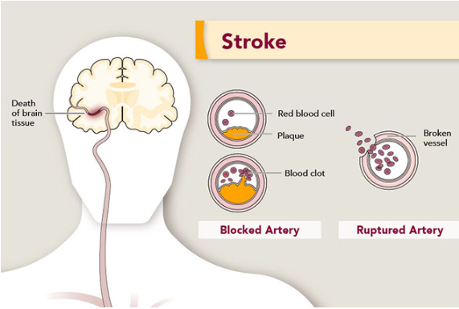

# Entregable: Definición de la línea base y alcance del proyecto

Instructor: Carlos Mejia
Student: Gabriela Sánchez

La línea base (modelo de referencia) debe ser un modelo simple que actúe como una comparación y sea fácil de explicar. Además, la línea base debe basarse en el conjunto de datos para crear el modelo real.

En este entregable se identifica la naturaleza del dataset que ha sido asignado, y se responden las siguientes preguntas:

1. ¿Qué problema aborda?
2. ¿Qué soluciones (notebooks) ya tiene desarrollados?
3. ¿Cuál de todas las soluciones contiene lo mínimo necesario para
poder entrenar y guardar un modelo?

El problema que aborda es de prevención de ataques:

According to the World Health Organization (WHO) stroke is the 2nd leading cause of death globally, responsible for approximately 11% of total deaths. This dataset is used to predict whether a patient is likely to get stroke based on the input parameters like gender, age, various diseases, and smoking status. Each row in the data provides relavant information about the patient.

El data se llama: "healthcare-dataset-stroke-data"

* Attribute Information:

    - id: unique identifier
    - gender: "Male", "Female" or "Other"
    - age: age of the patient
    - hypertension: 0 if the patient doesn't have hypertension, 1 if the patient has hypertension
    - heart_disease: 0 if the patient doesn't have any heart diseases, 1 if the patient has a heart disease
    - ever_married: "No" or "Yes"
    - work_type: "children", "Govt_jov", "Never_worked", "Private" or "Self-employed"
    - Residence_type: "Rural" or "Urban"
    - avg_glucose_level: average glucose level in blood
    - bmi: body mass index
    - smoking_status: "formerly smoked", "never smoked", "smokes" or "Unknown"*
    - stroke: 1 if the patient had a stroke or 0 if not
    
    Note: "Unknown" in smoking_status means that the information is unavailable for this patient
    
    Reference: https://www.kaggle.com/fedesoriano/stroke-prediction-dataset

Existen múltiples soluciones desarrolladas, dentro de las cuales revisé particularmente las dos siguientes:

- stroke-prediction-effect-of-data-leakage-smote.ipynb
- beginner-friendly-end-to-end-ml-project-enjoy.ipynb

La que tomé como base es la última "beginner-friendly-end-to-end-ml-project-enjoy.ipynb".

El alcance del modelo es:
- Tomar el dataset con los inputs para entrenar un modelo que pueda predecir la probabilidad de tener un ataque considerando algunas caracterírsticas de los pacientes/personas.